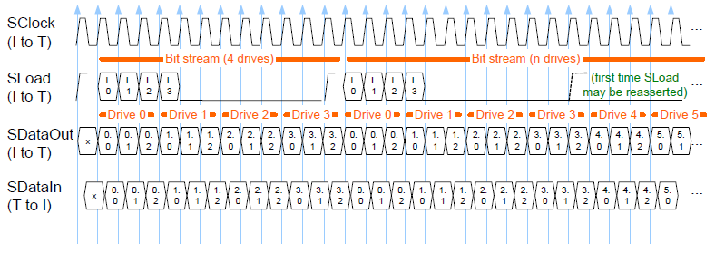
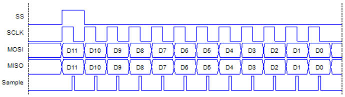

[Click here](../README.md) to view the README.

## Design and implementation

The design of this application is minimalistic to get started with code examples on PSOC&trade; Edge MCU devices. All PSOC&trade; Edge E84 MCU applications have a dual-CPU three-project structure to develop code for the CM33 and CM55 cores. The CM33 core has two separate projects for the secure processing environment (SPE) and non-secure processing environment (NSPE). A project folder consists of various subfolders, each denoting a specific aspect of the project. The three project folders are as follows:

**Table 1. Application projects**

Project | Description
--------|------------------------
*proj_cm33_s* | Project for CM33 secure processing environment (SPE)
*proj_cm33_ns* | Project for CM33 non-secure processing environment (NSPE)
*proj_cm55* | CM55 project

In this code example, at device reset, the secure boot process starts from the ROM boot with the secure enclave (SE) as the root of trust (RoT). From the secure enclave, the boot flow is passed on to the system CPU subsystem where the secure CM33 application starts. After all necessary secure configurations, the flow is passed on to the non-secure CM33 application. Resource initialization for this example is performed by this CM33 non-secure project. It configures the system clocks, pins, clock to peripheral connections, and other platform resources. It then enables the CM55 core using the `Cy_SysEnableCM55()` function and the CM55 core is subsequently put to DeepSleep mode.

In the CM33 non-secure application, the clocks and system resources are initialized by the BSP initialization function. The retarget-io middleware is configured to use the debug UART and the USER LED 1 is initialized. 

This design provides source files (*sgpio_target.c/h*) to implement the SGPIO target interface. It requires an SPI resource and a smart I/O resource. All the initialization of these blocks are handled by the application source files. You need to configure only the clocks and pin assignment for the SPI and smart I/O.

### SGPIO interface overview

The SGPIO interface time diagram is shown as follows. It streams information about 4 drives, where each drive contains 3 bits.

**Figure 1. Repeating bit stream (from SFF-8485)**

Due to the similarities to the SPI interface, you can leverage the SPI controller to simulate the SGPIO initiator. The SPI controller is configured with the **Sub Mode** set to **TI (Start Coincides)** and the data width set to 12 (size of the SGPIO frame for 4 drives).

**Figure 2. SPI frame as SGPIO initiator**

> **Note:** The SGPIO target can support up to 20 drives, but the SGPIO initiator in this example only works with 4 drives.

The mapping between the two interfaces is shown in the following table:

**Table 2. SPI and SGPIO mapping**

SPI signal  |  SGPIO signal  | Description
------- | ------------   | ----
SCLK | SClock            | Clock driven by the SPI controller/SGPIO initiator
MOSI | SDataOut          | Data driven by the SPI controller/SGPIO initiator
MISO | SDataIn           | Data driven by the SPI slave/SGPIO target
SS   | SLoad             | Indicates when the bit stream starts

> **Note:** SLoad in the SGPIO interface contains some additional vendor-specific bits. These bits are not supported in this implementation.

Each SGPIO frame contains information about a drive. It has three bits and can indicate the drive's information, such as activity, location, and errors.

### Clocking

The SGPIO interface requires a bus clock of up to 100 kHz. Therefore, the SPI controller (SGPIO initiator) data rate is configured to 100 kbps.

The SPI slave (SGPIO target) data rate is configured to a higher data rate (1000 kbps) to work with the smart I/O, which is sourced by the same clock linked to the SGPIO target.

### Firmware overview

The firmware is designed to constantly send data over the SGPIO interface. When the kit's button is pressed, the drive's information is printed to the terminal. 

The SGPIO target init function requires an SPI resource and smart I/O resource as arguments. The SPI resource is configured to generate an interrupt when the Rx buffer is not empty. The interrupt handler parses the bits to construct the SGPIO frame so that you can use high-level functions in the firmware to read/write to the SGPIO bus.

The smart I/O resource is configured to translate the SGPIO-SLoad signal to the SPI-SS signal. It uses the internal LUTs to detect the rising edge of the SGPIO-SLoad signal, which indicates when the SPI-SS signal needs to assert. The data lines between the SPI and SGPIO behave identically, not requiring any manipulation by the smart I/O resource.

There are two interrupts in this code example:
- **button_interrupt_handler:** It triggers on pressing the kit's button. It sets a flag to be read in the main loop

- **sgpio_interrupt_handler:** It triggers when the SGPIO target's internal FIFO has data. It executes the SGPIO target interrupt function

 